# OpenFinance Simulator — Análise do Projeto

## O que é o projeto

É um **servidor mock** que simula as APIs do Open Finance Brasil (antes chamado Open Banking). O objetivo é permitir que devs integrem com as APIs do Open Finance sem precisar de acesso real a um banco financeiro.

---

## Stack

- **Runtime:** Node.js + TypeScript
- **Framework HTTP:** Koa.js
- **Roteamento:** `@koa/router`
- **Banco:** MongoDB (via Mongoose) — conectado, mas não usado de fato
- **Execução:** `tsx` ou `node --experimental-strip-types`

---

## Como o app sobe

```
src/index.ts → cria servidor HTTP
src/app.ts   → configura middleware (bodyparser, logger, router)
src/router.ts → registra ~87 rotas
```

Porta padrão: `5681` (via env `PORT`).

---

## Estrutura de endpoints (87 no total)

| Domínio | Exemplos |
|---|---|
| `accounts/` | listar contas, saldos, transações, cheque especial |
| `payments/` | criar/consultar consentimento PIX, fazer pagamento PIX |
| `consents/` | criar/deletar/consultar consentimentos |
| `customers/` | dados de pessoa física e jurídica |
| `credit-cards/` | cartões, faturas, limites |
| `loans/` | contratos de crédito, parcelas, garantias |
| `investments/` | renda fixa, variável, tesouro |
| `discovery/` | status do serviço, outages |
| `exchange/` | câmbio, taxas online |
| `insurances/` | seguros patrimoniais e de pessoas |
| `capitalization/` | títulos de capitalização |
| `pension/` | planos de previdência |
| `acquiring/` | terminais POS, contratos de adquirência |
| `channels/` | agências, canais eletrônicos, ATMs |

---

## Como cada endpoint funciona

Todos retornam respostas estáticas/hardcoded no formato padrão do Open Finance:

```typescript
{
  data: { brand: { name: 'Open Finance Bank', companies: [...] } },
  meta: { totalRecords: 0, totalPages: 1, requestDateTime: '...' },
  endpoint: '/open-banking/accounts/v1/accounts'
}
```

A única exceção com lógica dinâmica é o **pagamento PIX** (`paymentsPixPaymentsPost`), que:
- Gera um `paymentId` via `uuidv4()`
- Ecoa o `consentId` do body da requisição
- Gera um `endToEndId` aleatório

---

## Detalhamento de endpoints por domínio

### Health & Status
- `GET /status` — health check com ping no MongoDB
- `GET /open-banking/discovery/v1/status` — retorna status `UP`

### Discovery
- `GET /open-banking/discovery/v1/outages` — lista de outages (vazia)
- `GET /open-banking/discovery/v1/resources` — recursos disponíveis

### Channels
- `GET /open-banking/channels/v1/branches`
- `GET /open-banking/channels/v1/electronic-channels`
- `GET /open-banking/channels/v1/phone-channels`
- `GET /open-banking/channels/v1/banking-agents`
- `GET /open-banking/channels/v1/shared-automated-teller-machines`

### Products & Services (12 endpoints)
- Contas pessoais e empresariais
- Empréstimos, financiamentos, cartões de crédito
- Cheque especial e antecipação de recebíveis (PF e PJ)

### Consents
- `GET    /open-banking/consents/v1/consents`
- `POST   /open-banking/consents/v1/consents`
- `GET    /open-banking/consents/v1/consents/:consentId`
- `DELETE /open-banking/consents/v1/consents/:consentId`

### Accounts
- `GET /open-banking/accounts/v1/accounts`
- `GET /open-banking/accounts/v1/accounts/:accountId`
- `GET /open-banking/accounts/v1/accounts/:accountId/balances`
- `GET /open-banking/accounts/v1/accounts/:accountId/transactions`
- `GET /open-banking/accounts/v1/accounts/:accountId/overdraft-limits`

### Payments (PIX)
- `POST /open-banking/payments/v1/consents`
- `GET  /open-banking/payments/v1/consents/:consentId`
- `PUT  /open-banking/payments/v1/consents/:consentId`
- `POST /open-banking/payments/v1/pix/payments`
- `GET  /open-banking/payments/v1/pix/payments/:paymentId`

### Credit Cards
- Listagem, detalhes, faturas, limites e transações por cartão

### Loans / Financings / Invoice Financings / Unarranged Overdraft
- Contratos, pagamentos, parcelas agendadas e garantias (5 endpoints cada)

### Investments
- Fundos, renda fixa bancária, renda fixa crédito, renda variável, tesouro direto

---

## Formato de resposta padrão

```typescript
// Resposta genérica (maioria dos endpoints)
{
  data: {
    brand: {
      name: 'Open Finance Bank',
      companies: [
        {
          name: 'Company A',
          cnpjNumber: '12345678901234',
          accounts: []   // array vazio — sem dados reais
        }
      ]
    }
  },
  meta: {
    totalRecords: 0,
    totalPages: 1,
    requestDateTime: '2025-04-10T04:17:02.908Z'
  },
  endpoint: '/open-banking/accounts/v1/accounts'
}

// Resposta do POST /pix/payments (único endpoint com lógica dinâmica)
{
  data: {
    paymentId: '<uuid-v4>',
    consentId: '<ecoado do body>',
    creationDateTime: '<now ISO>',
    status: 'RCVD',
    endToEndId: 'E<random>'
  }
}
```

---

## Configuração

### Variáveis de ambiente (`.env.example`)

```
NODE_ENV=development
MONGO_URI=mongodb://mongo:27017/openfinance
PORT=5681
```

### Scripts disponíveis

```bash
pnpm start        # node com suporte nativo a TypeScript
pnpm start:tsx    # execução via tsx
pnpm dev          # modo watch + carrega .env
pnpm dev:tsx      # modo watch via tsx
```

### Docker

```bash
docker compose up   # sobe app (porta 5681) + MongoDB (porta 27017)
```

---

## Modelo de dados — Dependências entre collections

```mermaid
erDiagram
    Customer ||--o{ Account : "tem"
    Customer ||--o{ CreditCardAccount : "tem"
    Customer ||--o{ DataSharingConsent : "autoriza"
    Customer ||--o{ PaymentConsent : "inicia"
    Customer ||--o{ Contract : "possui"
    Customer ||--o{ Investment : "investe"
    Customer ||--o{ ExchangeOperation : "opera"

    Account ||--o{ AccountTransaction : "gera"

    CreditCardAccount ||--o{ CreditCardBill : "gera"
    CreditCardAccount ||--o{ CreditCardTransaction : "registra"
    CreditCardBill    ||--o{ CreditCardTransaction : "agrupa"

    PaymentConsent ||--o{ PixPayment : "autoriza"

    Customer {
        string customerId PK
        string customerType "PF | PJ"
        string cpfNumber
        string cnpjNumber
    }
    Account {
        string accountId PK
        string customerId FK
        string type "CONTA_DEPOSITO_A_VISTA | CONTA_POUPANCA | ..."
        object balance "embedded: availableAmount, blockedAmount, ..."
    }
    AccountTransaction {
        string transactionId PK
        string accountId FK
        number amount "em centavos"
        date transactionDate
    }
    CreditCardAccount {
        string creditCardAccountId PK
        string customerId FK
        array limits "embedded: limitAmount, usedAmount, availableAmount"
    }
    CreditCardBill {
        string billId PK
        string creditCardAccountId FK
        number billTotalAmount "em centavos"
        date dueDate
    }
    CreditCardTransaction {
        string transactionId PK
        string creditCardAccountId FK
        string billId FK
        number amount "em centavos"
    }
    DataSharingConsent {
        string consentId PK
        string customerId FK
        string status "AWAITING_AUTHORISATION | AUTHORISED | REJECTED | REVOKED | CONSUMED"
        array permissions
    }
    PaymentConsent {
        string consentId PK
        string customerId FK
        string status "AWAITING_AUTHORISATION | AUTHORISED | REJECTED | CONSUMED"
        number amount "em centavos"
    }
    PixPayment {
        string paymentId PK
        string consentId FK
        string status "PDNG | ACSP | ACSC | ACCC | RJCT | ..."
        number amount "em centavos"
    }
    Contract {
        string contractId PK
        string customerId FK
        string contractType "EMPRESTIMOS | FINANCIAMENTOS | DIREITOS_CREDITORIOS_DESCONTADOS | ADIANTAMENTO_A_DEPOSITANTES"
        number contractAmount "em centavos"
    }
    Investment {
        string investmentId PK
        string customerId FK
        string investmentType "RENDA_FIXA_BANCARIA | RENDA_FIXA_CREDITO | RENDA_VARIAVEL | TITULO_PUBLICO"
        number investedAmount "em centavos"
    }
    ExchangeOperation {
        string operationId PK
        string customerId FK
        number foreignCurrencyAmount "em centavos"
        number localCurrencyAmount "em centavos"
    }
```



### Regras de design

- **`Customer` é a âncora** — toda collection referencia `customerId`
- **`balance` embedado em `Account`** — evita join para leitura de saldo
- **`limits` embedado em `CreditCardAccount`** — array de limites por modalidade
- **`Contract` unificado** — um document por contrato com `contractType` como discriminador; queries filtram por `{ customerId, contractType }`
- **`Investment` unificado** — mesmo padrão com `investmentType`
- **Todos valores monetários em centavos** — `Number` inteiro, sem float
- **Índices compostos** em `AccountTransaction` e `CreditCardTransaction` por `(id, date DESC)` — otimiza queries de histórico paginado

---

## O que NÃO está implementado

| Funcionalidade | Situação |
|---|---|
| Autenticação / autorização | Ausente — todos os endpoints são públicos |
| Persistência de dados | MongoDB conectado mas ocioso |
| Simulação de estado | Saldos não mudam, pagamentos não transitam entre status |
| Validação de inputs | Nenhuma — body aceito sem verificação |
| Testes | Sem arquivos de teste, sem framework configurado |
| HTTPS / CORS / Rate limiting | Ausentes |

---

## Oportunidades para o teste técnico

As principais melhorias esperadas em um teste técnico sobre este simulador são:

1. **Persistência real com MongoDB** — salvar consentimentos, pagamentos e contas
2. **Fluxo de pagamento PIX** — transicionar status: `RCVD` → `ACSP` → `ACCC`
3. **Autenticação** — validar tokens nos endpoints protegidos (OAuth2 / JWT)
4. **Testes** — cobertura dos endpoints com Jest ou Vitest
5. **Validação de inputs** — rejeitar payloads inválidos com erro adequado
